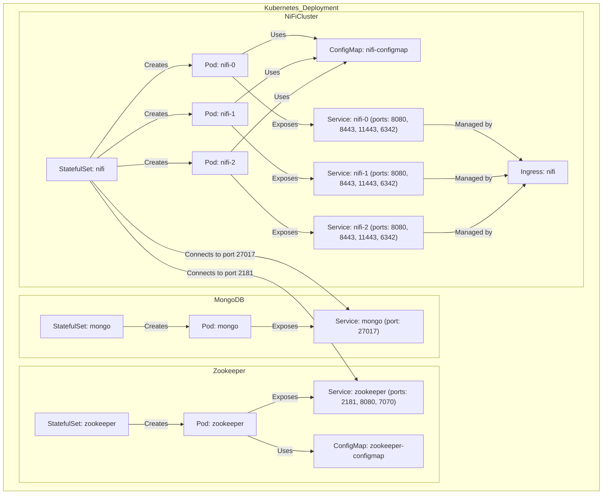

```mermaid
graph TD;
    subgraph Kubernetes_Deployment
        subgraph MongoDB
            MongoStatefulSet["StatefulSet: mongo"]
            MongoService["Service: mongo (port: 27017)"]
            MongoPod["Pod: mongo"]
            MongoStatefulSet -->|Creates| MongoPod
            MongoPod -->|Exposes| MongoService
        end

        subgraph Zookeeper
            ZookeeperConfigMap["ConfigMap: zookeeper-configmap"]
            ZookeeperStatefulSet["StatefulSet: zookeeper"]
            ZookeeperService["Service: zookeeper (ports: 2181, 8080, 7070)"]
            ZookeeperPod["Pod: zookeeper"]
            ZookeeperStatefulSet -->|Creates| ZookeeperPod
            ZookeeperPod -->|Exposes| ZookeeperService
            ZookeeperPod -->|Uses| ZookeeperConfigMap
        end

        subgraph NiFiCluster
            NiFiConfigMap["ConfigMap: nifi-configmap"]
            NiFiStatefulSet["StatefulSet: nifi"]
            NiFiIngress["Ingress: nifi"]
            NiFiService0["Service: nifi-0 (ports: 8080, 8443, 11443, 6342)"]
            NiFiService1["Service: nifi-1 (ports: 8080, 8443, 11443, 6342)"]
            NiFiService2["Service: nifi-2 (ports: 8080, 8443, 11443, 6342)"]
            NiFiPod0["Pod: nifi-0"]
            NiFiPod1["Pod: nifi-1"]
            NiFiPod2["Pod: nifi-2"]

            NiFiStatefulSet -->|Creates| NiFiPod0
            NiFiStatefulSet -->|Creates| NiFiPod1
            NiFiStatefulSet -->|Creates| NiFiPod2

            NiFiPod0 -->|Exposes| NiFiService0
            NiFiPod1 -->|Exposes| NiFiService1
            NiFiPod2 -->|Exposes| NiFiService2

            NiFiService0 -->|Managed by| NiFiIngress
            NiFiService1 -->|Managed by| NiFiIngress
            NiFiService2 -->|Managed by| NiFiIngress

            NiFiPod0 -->|Uses| NiFiConfigMap
            NiFiPod1 -->|Uses| NiFiConfigMap
            NiFiPod2 -->|Uses| NiFiConfigMap
        end
    end

    NiFiStatefulSet -->|Connects to port 2181| ZookeeperService
    NiFiStatefulSet -->|Connects to port 27017| MongoService
```
